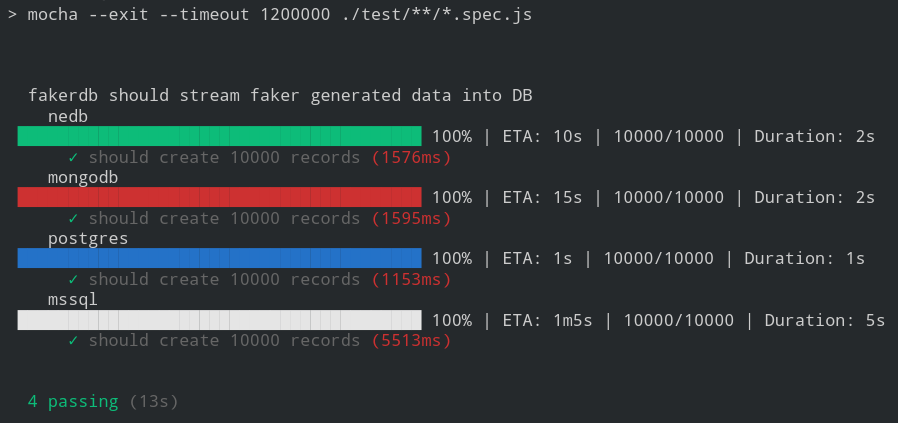
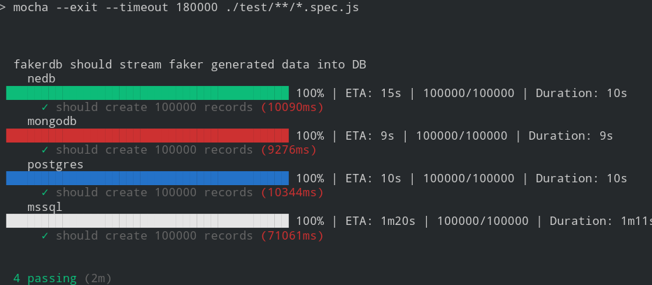
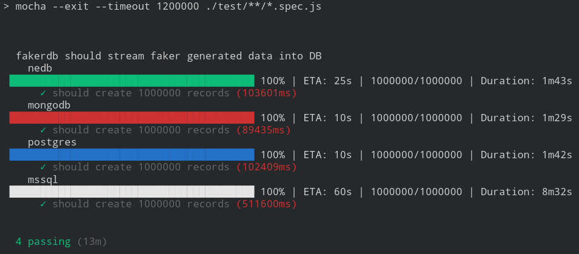

[](https://travis-ci.com/sius/fakerdb)[](https://codecov.io/gh/sius/fakerdb)[](https://david-dm.org/sius/fakerdb)[](https://david-dm.org/sius/fakerdb?type=dev)

# fakerdb

Generate an unlimited stream of JSON schema instances using [json-schema-faker](https://www.npmjs.com/package/json-schema-faker), [faker](https://www.npmjs.com/package/faker), [chance](https://www.npmjs.com/package/chance) and insert the data into a supported database, e.g.: [nedb](https://www.npmjs.com/package/nedb), [mongodb](https://www.npmjs.com/package/mongodb), [postgres](https://www.npmjs.com/package/pg), [mssql](https://www.npmjs.com/package/mssql).

## Getting Started

```console
npm install

# run docker container
docker-compose up -d

npm test

# stop docker container
docker-compose down
```
### Test Results and Performance

**Test Environment**
- Intel® Core™ i7-3520M CPU @ 2.90GHz × 4
- 7.5 GiB
- Linux 64 bit

JSON schema

```json
// person.json
{
  "type": "object",
  "properties": {
    "name": {
      "type": "string",
      "faker": "name.findName"
    }
  },
  "required": [
    "name"
  ]
}
```

#### Insert 10^5 Records




#### Insert 10^6 Records




#### Insert 10^7 Records 




## API Usage

Install
```
npm i fakerdb
```

###  Stream to STDOUT

```javascript
// examples/faker-stdout.js

var { replay, jsf } = require('fakerdb')
, faker = require('faker')
, jsonSchemaFaker = require('json-schema-faker')
, path = require('path');

jsonSchemaFaker.extend('faker', () => faker);

const SCHEMA_OBJ = {
  type: 'object',
  properties: {
    name: {
      type: 'string',
      faker: 'name.findName'
    }
  },
  required: [
    'name'
  ]
};

replay(SCHEMA_OBJ, { replay: 2 })
  .pipe(jsf(jsonSchemaFaker))
  .pipe(process.stdout);

const SCHEMA_FILE = path.join(__dirname, './schema/person.json');
replay(SCHEMA_FILE, { replay: 2 })
    .pipe(jsf(jsonSchemaFaker))
    .pipe(process.stdout);

```

### Stream to file with nedb

```javascript
// examples/faker-nedb.js

let { generate }  = require('fakerdb')
  , Datasource = require('nedb')
  , db = new Datasource({ filename: 'faker.db', autoload: true })
  , path = require('path');

const REPLAY = 1000;
const SCHEMA  = path.join(__dirname, './schema/person.json');
const OPTS = { replay: REPLAY, insert: { blockSize: 1000 } };

generate(db, SCHEMA, OPTS);
```

### Stream to database

- [PostgreSQL](./examples/faker-pg.js)
- [MongoDb](./examples/faker-mongodb.js)

## fakerdb CLI

### Use

```console
npm i -g fakerdb
fakerdb --help
```

## Custom Faker Example

### Create Standard Normal Distributed Samples

- [JSON Schema Example](./examples/faker/person.json)
- [Custom Faker Example](./examples/faker/custom.js)
- [Custom Json Schema Faker](./examples/faker/custom-jsf.js)

### Use
```
cd examples/faker
fakerdb g -r 200000 -i person.json -f custom-jsf.js -b 1000 -o people.db 
```

# References
- [json-schema-faker](https://www.npmjs.com/package/json-schema-faker)
- [faker](https://www.npmjs.com/package/faker)
- [chance](https://www.npmjs.com/package/chance)
- [probability-distributions](https://www.npmjs.com/package/probability-distributions)
- [nedb](https://www.npmjs.com/package/nedb)
- [mongodb](https://www.npmjs.com/package/mongodb)
- [knex](https://www.npmjs.com/package/knex)
- [postgres](https://www.npmjs.com/package/pg)
- [mssql](https://www.npmjs.com/package/mssql)
